# WireCrab 嗅探器实验报告
## 1. 基本介绍
UCAS软件与系统安全作业

WireCrab 是一个使用 Rust 语言开发的网络数据包嗅探与分析工具(100% vibe coding)。
目前支持对以下协议的解析：
• 链路层: Ethernet

• 网络层: IPv4/v6, ARP

• 传输层: TCP, UDP

• 应用层: HTTP, HTTPS, DNS, FTP, TLS

工具分为两个主要部分：一个核心的cli工具，用于进行底层的网络抓包和数据处理；以及一个基于 `egui` 的图形用户界面，为用户提供一个直观、交互式的网络分析环境。
### 主要技术栈

*   **编程语言**: Rust
*   **核心库**:
    *   `pcap`: 用于网络数据包的捕获。
    *   `etherparse`: 用于解析网络协议数据包。
    *   `clap`: 用于构建功能丰富的命令行界面。
    *   `serde`: 用于数据的序列化和反序列化，尤其是在将解析结果展示为 JSON 时。
    *   `egui` & `eframe`: 用于构建跨平台的图形用户界面。
    *   `crossbeam`: 用于多线程间的数据通信。

## 2. 设计框架

### 2.1 整体架构图

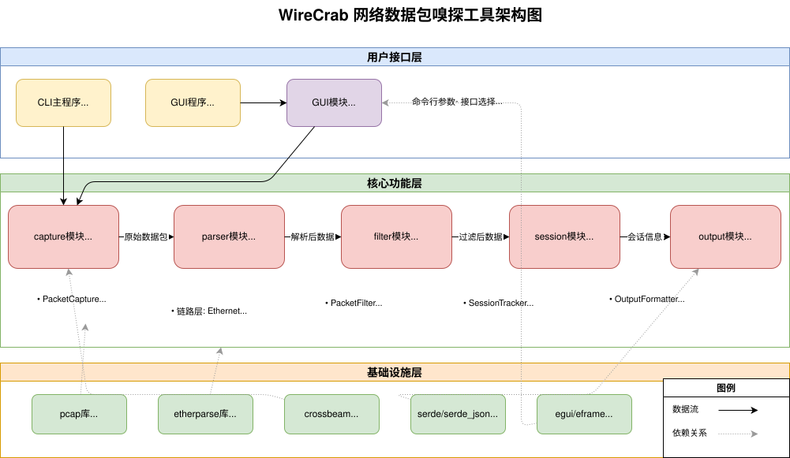

### 2.2 模块设计

WireCrab 的核心逻辑被组织在一系列的模块中，实现了高度的内聚和低耦合。

*   **`capture` 模块**: 负责底层的网络数据包捕获。
*   **`parser` 模块**: 负责对捕获到的原始数据包进行层层解析。
*   **`filter` 模块**: 负责根据用户定义的规则对解析后的数据包进行筛选。
*   **`session` 模块**: 负责追踪网络会话（特别是 TCP 连接）并重组数据流。
*   **`gui` 模块**: 负责实现所有的图形界面逻辑。
*   **`output` 模块**: （主要用于命令行工具）负责将解析结果格式化为指定的输出格式（如 JSON）。

### 2.3 GUI 设计框架

GUI 采用多线程模型以确保界面的流畅性和响应性。

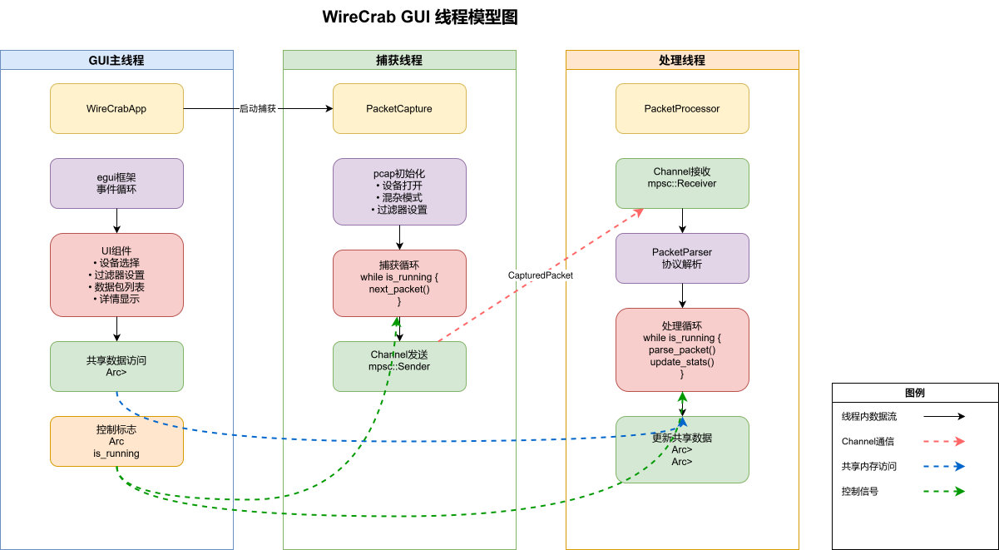

## 3. 具体开发和实现过程
### 3.1 数据包捕获 (`capture` 模块)

#### 关键程序

*   [`src/capture/mod.rs`](src/capture/mod.rs:21): `PacketCapture` 结构体封装了 `pcap::Capture`。

*   [`src/capture/mod.rs`](src/capture/mod.rs:53): `start_capture` 方法在一个循环中捕获数据包，并通过 `mpsc` 通道将原始数据发送给处理线程。
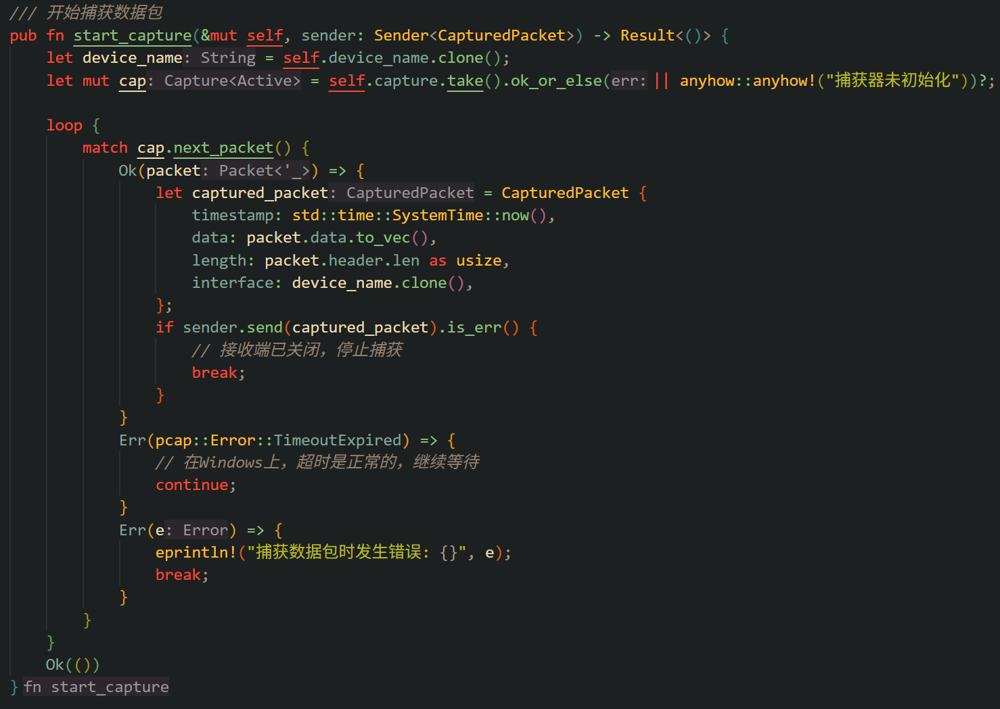

#### 流程图

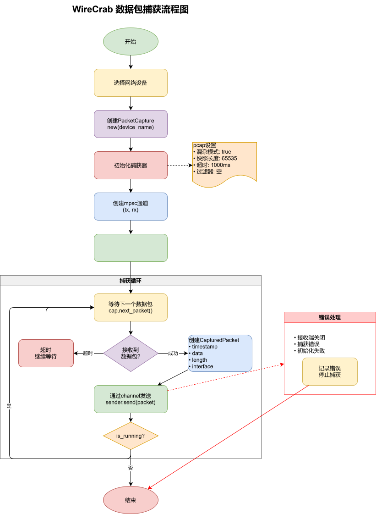

### 3.2 数据包解析 (`parser` 模块)

#### 关键程序

*   [`src/parser/mod.rs`](src/parser/mod.rs:122): `PacketParser` 结构体及其 `parse_packet` 方法是解析的核心入口。
*   [`src/parser/application/mod.rs`](src/parser/application/mod.rs:117): `parse_application_data` 函数根据端口号分发到不同的应用层协议解析器。
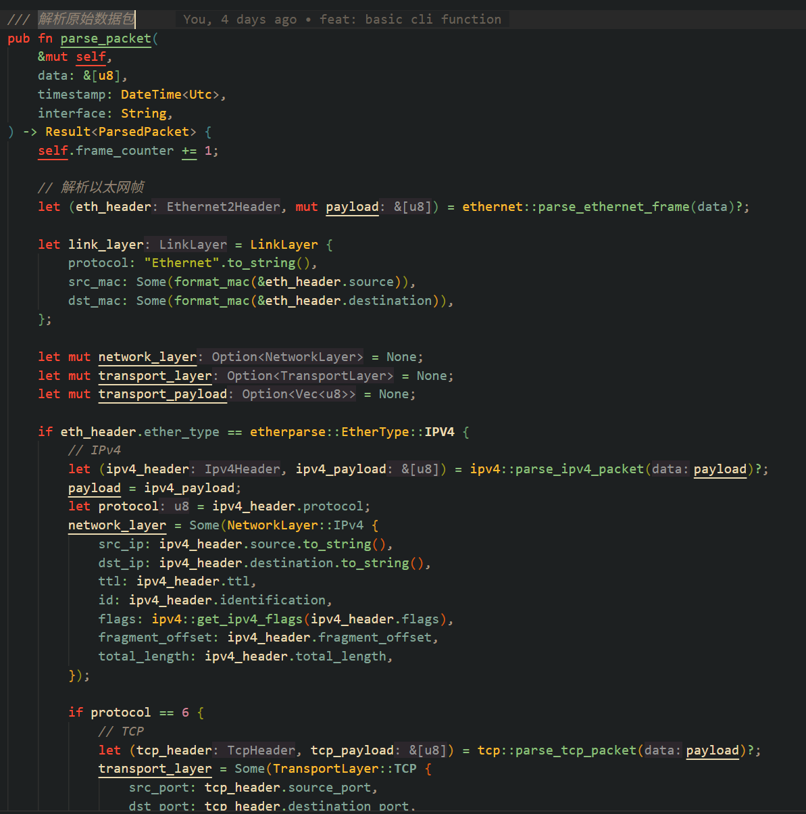
#### 流程图

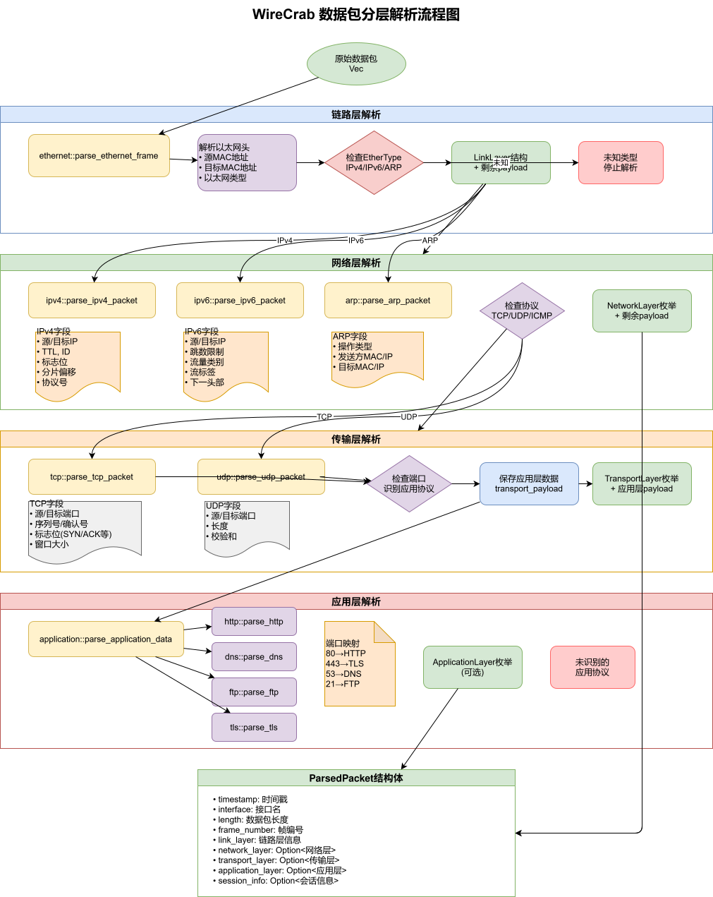

### 3.3 TCP 会话追踪与流重组 (此部分还未完成)

#### 关键程序

*   [`src/session/tracker.rs`](src/session/tracker.rs:38): `SessionTracker` 使用 `HashMap` 管理所有会话。
*   [`src/session/flow.rs`](src/session/flow.rs:20): `TcpFlow` 实现了 TCP 状态机和流重组逻辑。


### 3.4 图形用户界面 (`gui` 模块)

#### 关键程序

*   [`src/gui.rs`](src/gui.rs:41): `WireCrabApp` 结构体是 GUI 的主应用结构，管理所有状态和组件。
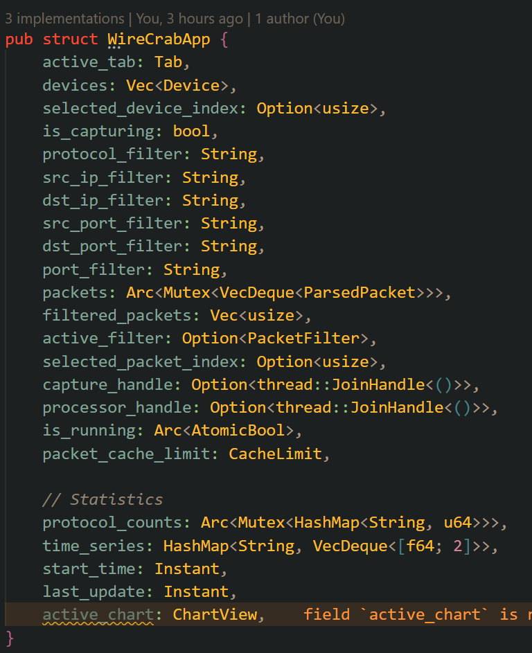
*   [`src/gui.rs`](src/gui.rs:160): 通过 `thread::spawn` 启动独立的抓包和处理线程，避免阻塞 UI。
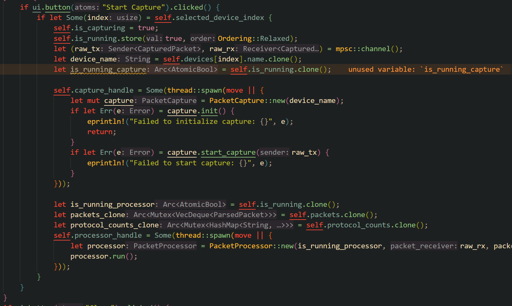
*   [`src/gui.rs`](src/gui.rs:285): 使用 `egui_extras::TableBuilder` 构建高性能的数据包列表。
*   [`src/gui.rs`](src/gui.rs:391): 使用 `egui_json_tree` 将解析结果以树状图展示。

## 4. 基本操作指南

### 4.1 命令行界面 (CLI) 操作指南

WireCrab 提供了功能强大的命令行界面，适合自动化脚本和无界面环境使用。

#### 4.1.1 基本用法

```bash
# 编译并运行命令行工具
cargo run --bin wirecrab -- [OPTIONS]

# 或者先编译后运行
cargo build --bin wirecrab --release
./target/release/wirecrab [OPTIONS]
```

#### 4.1.2 命令行参数说明

```
选项:
  -i, --interface <INTERFACE>      网络接口名称 (默认: 自动选择第一个可用接口)
  -c, --count <COUNT>              捕获数据包数量 (默认: 无限)
  -o, --output <OUTPUT>            输出到文件 (默认: stdout)
      --protocol <PROTOCOL>        协议类型过滤 (tcp|udp|arp|icmp|igmp|http|dns)
      --src-ip <SRC_IP>          源IP地址过滤
      --dst-ip <DST_IP>          目标IP地址过滤
      --src-port <SRC_PORT>      源端口过滤 (仅TCP/UDP)
      --dst-port <DST_PORT>      目标端口过滤 (仅TCP/UDP)
      --port <PORT>              端口过滤 (源或目标)
  -l, --list-interfaces            列出所有网络接口
  -v, --verbose                    详细输出模式
      --follow-stream              启用会话追踪（未完成）
      --session-timeout <SECONDS>  会话超时时间（秒）(默认: 300)
  -h, --help                       显示帮助信息
  -V, --version                    显示版本信息
```

#### 4.1.3 使用示例

**1. 列出所有网络接口**
```bash
cargo run --bin wirecrab -- --list-interfaces
```

输出示例：
```
可用的网络接口:
  1. eth0 - Ethernet Interface
     地址: 192.168.1.100
  2. lo - Loopback Interface
     地址: 127.0.0.1
```

**2. 在指定接口上抓包**
```bash
# 在 eth0 接口上抓包
cargo run --bin wirecrab -- -i eth0

# 抓取100个数据包后停止
cargo run --bin wirecrab -- -i eth0 -c 100
```

**3. 使用过滤器**
```bash
# 只抓取 TCP 协议数据包
cargo run --bin wirecrab -- -i eth0 --protocol tcp

# 抓取源IP为 192.168.1.100 的数据包
cargo run --bin wirecrab -- -i eth0 --src-ip 192.168.1.100

# 抓取目标端口为 80 的 HTTP 流量
cargo run --bin wirecrab -- -i eth0 --dst-port 80

# 组合过滤：TCP 协议且目标端口为 443 (HTTPS)
cargo run --bin wirecrab -- -i eth0 --protocol tcp --dst-port 443
```

**4. 会话追踪（未实现）**
```bash
# 启用TCP会话追踪，会话超时时间为600秒
cargo run --bin wirecrab -- -i eth0 --follow-stream --session-timeout 600
```

**5. 将结果保存到文件**
```bash
# 将抓包结果保存到 capture.json 文件
cargo run --bin wirecrab -- -i eth0 -o capture.json -c 1000
```

**6. 详细输出模式**
```bash
# 启用详细模式，显示解析失败的数据包信息
cargo run --bin wirecrab -- -i eth0 -v
```

#### 4.1.4 输出格式

CLI 工具输出 JSON 格式的数据包信息，每个数据包占一行，便于后续处理：

```json
{
  "timestamp": "2024-01-01T12:00:00Z",
  "interface": "eth0",
  "length": 1514,
  "frame_number": 1,
  "link_layer": {
    "protocol": "Ethernet",
    "src_mac": "00:11:22:33:44:55",
    "dst_mac": "66:77:88:99:AA:BB"
  },
  "network_layer": {
    "protocol": "IPv4",
    "src_ip": "192.168.1.100",
    "dst_ip": "8.8.8.8",
    "ttl": 64
  },
  "transport_layer": {
    "protocol": "TCP",
    "src_port": 54321,
    "dst_port": 443,
    "flags": ["SYN"]
  },
  "session_info": {
    "session_id": "TCP:192.168.1.100:54321-8.8.8.8:443",
    "direction": "request",
    "stream_index": 1,
    "total_bytes": 1514,
    "duration_ms": 0
  }
}
```

#### 4.1.5 权限要求

在大多数操作系统上，网络抓包需要管理员权限：

```bash
# Linux/macOS
sudo cargo run --bin wirecrab -- -i eth0

# Windows (以管理员身份运行命令提示符)
cargo run --bin wirecrab -- -i "Ethernet"
```

### 4.2 图形界面 (GUI) 操作指南

#### 4.2.1 启动应用

通过 `cargo run --bin wirecrab-gui` 命令启动图形界面应用。

#### 4.2.2 选择网络接口

启动后，在 "Interface" 下拉菜单中选择一个用于抓包的网络接口。

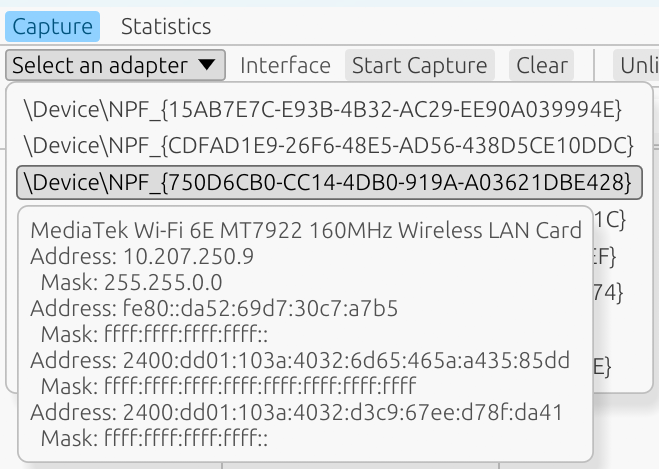

#### 4.2.3 开始与停止抓包

点击 "Start Capture" 按钮开始抓包。数据包列表将实时更新。点击 "Stop Capture" 停止。


#### 4.2.4 应用过滤器

在 "Filter Options" 区域输入过滤条件，例如在fliter option中选择"tcp"、目标ip和端口，然后点击 "Apply" 按钮。列表将只显示符合条件的数据包。
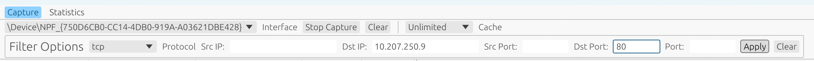


#### 4.2.5 查看数据包详情

在列表中单击任意一个数据包，下方将展示该数据包的详细解析信息（树状结构）和原始数据（十六进制视图）。

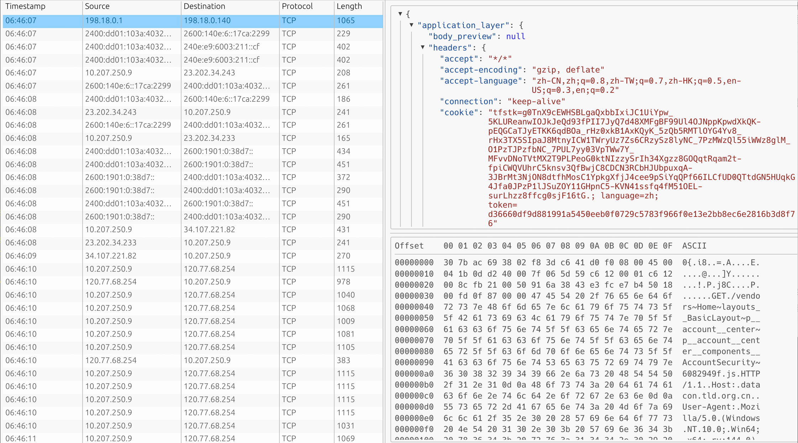

#### 4.2.6 查看统计信息

切换到 "Statistics" 标签页，可以查看协议流量的实时统计图表。
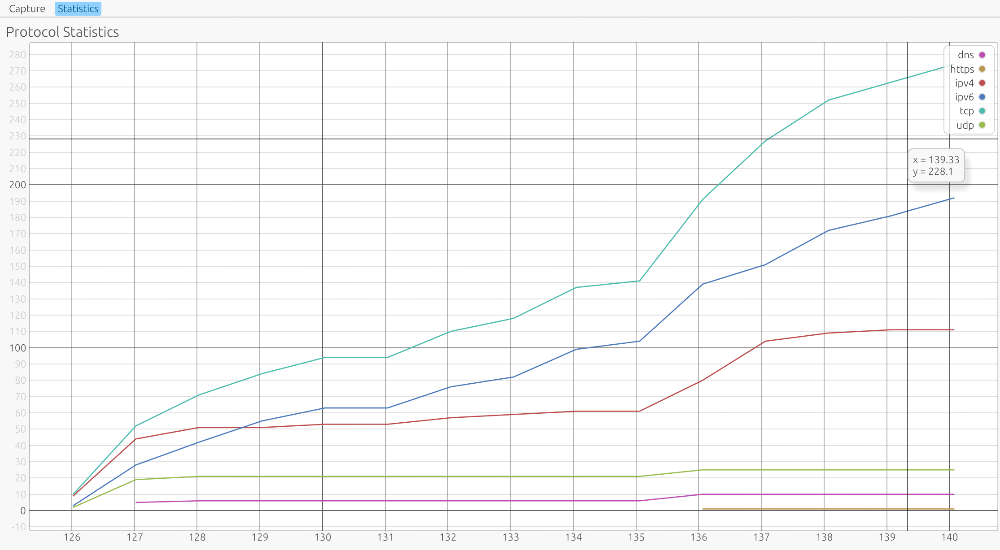
