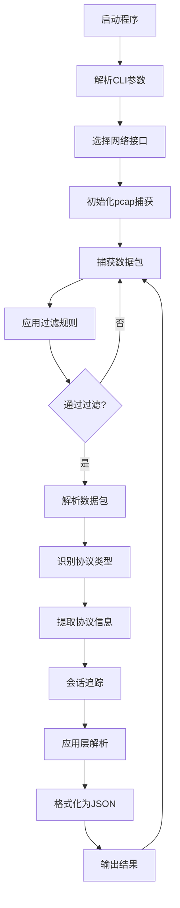

# WireCrab 网络数据包嗅探工具架构设计

## 项目概述
WireCrab 是一个基于 Rust 开发的命令行网络数据包嗅探工具，支持解析常见网络协议并提供灵活的过滤功能。

## 核心功能
1. 支持协议：
   - 网络层：IPv4、IPv6、ARP、ICMP、ICMPv6、IGMP
   - 传输层：TCP、UDP
   - 应用层：HTTP/HTTPS、DNS、FTP、SSH、Telnet
2. 过滤功能：按协议类型、端口、地址过滤（支持IPv4/IPv6）
3. 输出格式：JSON格式，便于后续处理
4. 会话追踪：完整显示请求从发起到结束的所有交互过程

## 架构设计

### 1. 模块结构

```
wirecrab/
├── src/
│   ├── main.rs              # 程序入口，CLI参数处理
│   ├── capture/
│   │   ├── mod.rs          # 数据包捕获模块
│   │   └── device.rs       # 网络接口管理
│   ├── parser/
│   │   ├── mod.rs          # 数据包解析器主模块
│   │   ├── ethernet.rs     # 以太网层解析
│   │   ├── ipv4.rs         # IPv4协议解析
│   │   ├── ipv6.rs         # IPv6协议解析
│   │   ├── tcp.rs         # TCP协议解析
│   │   ├── udp.rs         # UDP协议解析
│   │   ├── arp.rs         # ARP协议解析
│   │   ├── icmp.rs        # ICMP协议解析
│   │   ├── icmpv6.rs      # ICMPv6协议解析
│   │   ├── igmp.rs        # IGMP协议解析
│   │   └── application/    # 应用层协议解析
│   │       ├── mod.rs      # 应用层主模块
│   │       ├── http.rs     # HTTP/HTTPS解析
│   │       ├── dns.rs      # DNS解析
│   │       ├── ftp.rs      # FTP解析
│   │       ├── ssh.rs      # SSH解析
│   │       └── telnet.rs   # Telnet解析
│   ├── session/
│   │   ├── mod.rs          # 会话追踪主模块
│   │   ├── tracker.rs      # 连接状态追踪
│   │   └── flow.rs        # 数据流管理
│   ├── filter/
│   │   ├── mod.rs          # 过滤器主模块
│   │   └── rules.rs       # 过滤规则定义
│   ├── output/
│   │   ├── mod.rs          # 输出格式化模块
│   │   └── json.rs        # JSON格式化器
│   └── error.rs            # 错误处理定义
```

### 2. 数据流程图



### 3. CLI 参数设计

```bash
wirecrab [OPTIONS]

OPTIONS:
    -i, --interface <INTERFACE>     网络接口名称 (默认: 自动选择)
    -c, --count <COUNT>            捕获数据包数量 (默认: 无限)
    -o, --output <FILE>            输出到文件 (默认: stdout)
    
    # 过滤选项
    --protocol <PROTOCOL>          协议类型过滤 (tcp|udp|arp|icmp|icmpv6|igmp|http|dns|ftp|ssh)
    --src-ip <IP>                 源IP地址过滤（支持IPv4/IPv6）
    --dst-ip <IP>                 目标IP地址过滤（支持IPv4/IPv6）
    --src-port <PORT>             源端口过滤 (仅TCP/UDP)
    --dst-port <PORT>             目标端口过滤 (仅TCP/UDP)
    --port <PORT>                 端口过滤 (源或目标)
    --app-protocol <PROTOCOL>      应用层协议过滤
    
    # 会话追踪选项
    --follow-stream                跟踪完整的数据流
    --session-timeout <SECONDS>    会话超时时间（默认：300秒）
    
    # 其他选项
    -l, --list-interfaces          列出所有网络接口
    -v, --verbose                  详细输出模式
    -h, --help                     显示帮助信息
```

### 4. 数据结构设计

#### 4.1 数据包信息结构

```rust
#[derive(Serialize, Debug)]
struct PacketInfo {
    timestamp: String,
    interface: String,
    length: usize,
    frame_number: u64,
    link_layer: LinkLayer,
    network_layer: Option<NetworkLayer>,
    transport_layer: Option<TransportLayer>,
    application_layer: Option<ApplicationLayer>,
    session_info: Option<SessionInfo>,
}

#[derive(Serialize, Debug)]
struct LinkLayer {
    protocol: String,
    src_mac: Option<String>,
    dst_mac: Option<String>,
}

#[derive(Serialize, Debug)]
#[serde(tag = "protocol")]
enum NetworkLayer {
    IPv4 {
        src_ip: String,
        dst_ip: String,
        ttl: u8,
        id: u16,
        flags: Vec<String>,
        fragment_offset: u16,
        total_length: u16,
    },
    IPv6 {
        src_ip: String,
        dst_ip: String,
        hop_limit: u8,
        traffic_class: u8,
        flow_label: u32,
        payload_length: u16,
    },
    ARP {
        operation: String,
        String,
        sender_ip: String,
        String,
        target_ip: String,
    },
}

#[derive(Serialize, Debug)]
#[serde(tag = "protocol")]
enum TransportLayer {
    TCP {
        src_port: u16,
        dst_port: u16,
        seq: u32,
        ack: u32,
        flags: Vec<String>,
        window: u16,
        checksum: u16,
        urgent_pointer: u16,
        options: Vec<String>,
    },
    UDP {
        src_port: u16,
        dst_port: u16,
        length: u16,
        checksum: u16,
    },
    ICMP {
        icmp_type: u8,
        icmp_code: u8,
        checksum: u16,
        data: String,
    },
    ICMPv6 {
        icmp_type: u8,
        icmp_code: u8,
        checksum: u16,
        data: String,
    },
}

#[derive(Serialize, Debug)]
#[serde(tag = "protocol")]
enum ApplicationLayer {
    HTTP {
        method: Option<String>,
        uri: Option<String>,
        version: String,
        status_code: Option<u16>,
        headers: HashMap<String, String>,
        body_preview: Option<String>,
    },
    DNS {
        transaction_id: u16,
        flags: Vec<String>,
        questions: Vec<DnsQuestion>,
        answers: Vec<DnsRecord>,
    },
    FTP {
        command: Option<String>,
        response_code: Option<u16>,
        message: String,
    },
    SSH {
        version: Option<String>,
        encrypted: bool,
    },
}

#[derive(Serialize, Debug)]
struct SessionInfo {
    session_id: String,
    direction: String,  // "request" or "response"
    stream_index: u64,
    related_packets: Vec<u64>,
    total_bytes: u64,
    duration_ms: u64,
}
```

#### 4.2 过滤规则结构

```rust
struct FilterRules {
    protocol: Option<Protocol>,
    src_ip: Option<IpAddr>,  // 支持IPv4和IPv6
    dst_ip: Option<IpAddr>,  // 支持IPv4和IPv6
    src_port: Option<u16>,
    dst_port: Option<u16>,
    port: Option<u16>,
    app_protocol: Option<ApplicationProtocol>,
}

enum Protocol {
    TCP,
    UDP,
    ARP,
    ICMP,
    ICMPv6,
    IGMP,
}

enum ApplicationProtocol {
    HTTP,
    HTTPS,
    DNS,
    FTP,
    SSH,
    Telnet,
}
```

### 5. JSON 输出格式示例

```json
{
  "timestamp": "2024-10-21T12:34:56.789Z",
  "interface": "eth0",
  "length": 1500,
  "frame_number": 42,
  "link_layer": {
    "protocol": "Ethernet",
    "src_mac": "00:11:22:33:44:55",
    "dst_mac": "66:77:88:99:AA:BB"
  },
  "network_layer": {
    "protocol": "IPv4",
    "src_ip": "192.168.1.100",
    "dst_ip": "8.8.8.8",
    "ttl": 64,
    "id": 12345,
    "flags": ["DF"],
    "fragment_offset": 0,
    "total_length": 1486
  },
  "transport_layer": {
    "protocol": "TCP",
    "src_port": 54321,
    "dst_port": 443,
    "flags": ["SYN"],
    "seq": 1234567890,
    "ack": 0,
    "window": 65535,
    "checksum": 43690,
    "urgent_pointer": 0,
    "options": ["MSS=1460", "SACK_PERMITTED", "WS=7"]
  },
  "application_layer": {
    "protocol": "HTTP",
    "method": "GET",
    "uri": "/api/data",
    "version": "HTTP/1.1",
    "headers": {
      "Host": "example.com",
      "User-Agent": "Mozilla/5.0",
      "Accept": "application/json"
    }
  },
  "session_info": {
    "session_id": "192.168.1.100:54321-8.8.8.8:443",
    "direction": "request",
    "stream_index": 0,
    "related_packets": [41, 43, 44],
    "total_bytes": 4567,
    "duration_ms": 125
  }
}
```

### 6. 错误处理策略

- 权限错误：需要 root/管理员权限才能捕获数据包
- 接口错误：指定的网络接口不存在
- 解析错误：数据包格式异常或不完整
- 过滤错误：无效的过滤参数

### 7. 依赖项说明

- **clap**: 用于命令行参数解析，使用 derive 特性简化代码
- **etherparse**: 用于解析以太网和IP协议数据包
- **pcap**: 用于捕获网络数据包
- **serde/serde_json**: 用于JSON序列化（需要添加）
- **chrono**: 用于时间戳处理（需要添加）
- **anyhow**: 用于错误处理（推荐添加）
- **nom**: 用于解析应用层协议（推荐添加）
- **httparse**: 用于HTTP协议解析（推荐添加）
- **dns-parser**: 用于DNS协议解析（推荐添加）

### 8. 实现优先级

1. 基础框架和CLI参数解析
2. 数据包捕获功能
3. 以太网和IP层解析（IPv4/IPv6）
4. TCP/UDP协议解析
5. 基本过滤功能
6. JSON输出格式化
7. 会话追踪功能
8. 应用层协议解析（HTTP、DNS等）
9. ARP、ICMP、ICMPv6、IGMP协议支持
10. 高级过滤功能
11. 性能优化和错误处理
12. 测试和文档

### 9. 性能考虑

- 使用零拷贝技术减少数据包处理开销
- 实现高效的过滤器，尽早丢弃不需要的数据包
- 考虑使用多线程处理：一个线程捕获，一个线程解析和输出
- 对于大流量场景，考虑实现环形缓冲区

### 10. 安全考虑

- 需要以适当权限运行（通常需要 root）
- 验证所有用户输入，防止注入攻击
- 限制内存使用，防止内存耗尽
- 考虑添加数据包数量限制选项